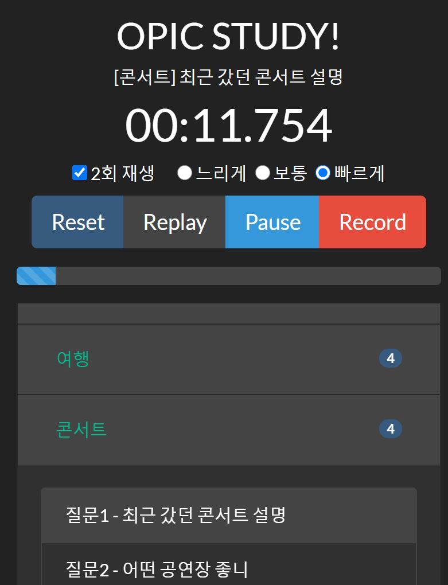

# OPIC.IO

본 프로그램의 mp3 파일은 해커스 오픽 교재에서 무료로 제공되는 파일들을 사용했습니다.  
[해커스 오픽 Start Intermediate 교재](http://www.kyobobook.co.kr/product/detailViewKor.laf?ejkGb=KOR&mallGb=KOR&barcode=9791158551988&orderClick=LEa&Kc=)  
(만약, 문제가 된다면 넷상에 떠도는 문제 없는 아무 mp3나 쓰겠음.)

- 주요 기능
    - 2분 타이머 기능 (일시정지, 리플레이 포함)
    - 주제별 재생 (선택, 돌발, 롤플)
    - 남은 시간별 진행 상태 표시 (시작, 적절, 경고, 끝내!!)
    - 랜덤 주제 뽑기 (선택, 돌발, 롤플)
    - 질문 재생 속도 조절 (느림, 보통, 빠름)
    - 1~2회 자동 반복 재생
    - 마이크 녹음 기능 (powered by Recordjs)
    - 폰 이용 시, 화면 안꺼지고 유지됨 (powered by NoSleepJS)

- 프로그램 화면 (Web-Application)

    

    - github pages 공부겸, 정적웹 만들기 연습 프로젝트
    - 오픽 모의고사 준비를 편하게 하기 위해 개발.
    - 선택 주제는 내가 선택할 것들만 골랐음.
    - boostrap을 이용해서 반응형 레이아웃, resizing 되므로,  
    모바일 기기에서도 UX면에서 불편함이 없음.
    - IOS Safari 호환성 때문에 고생함..

- 사용된 라이브러리 및 프레임워크
    - JQuery (https://jquery.com/) - MIT License
    - Bootstrap (https://getbootstrap.com/) - MIT License
    - NoSleep (https://github.com/richtr/NoSleep.js/) - MIT License
    - Recorderjs (https://github.com/mattdiamond/Recorderjs) - MIT License
    - Modernizr (https://modernizr.com/) - MIT License

- 몇가지 버그
    - 에바가 질문할 때, 다른 UI 통해서 음악 일시 정지하면.. 안돼여.. ^.^  
    (고칠 생각 없음)

- 참고 사항
    - 실 서버 없이 정적 컨텐츠만으로 동작하는 웹앱
    - 개인 프로젝트 목적이 있으므로, 광고나 사용에 대한 대가 바라지 않음.
    - 브라우저 안에서 데이터가 처리됨, 즉 녹화 시 누군가에게 전송되지 않음.
    - chrome, IOS safari에서 일부 테스트 되었으나 버그 있을 수 있음!
